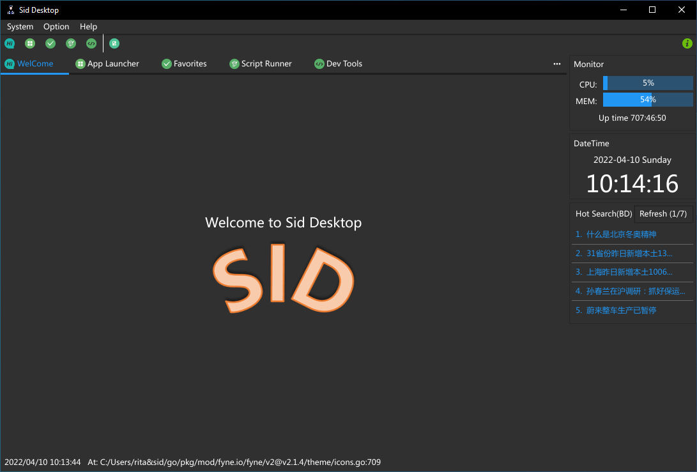
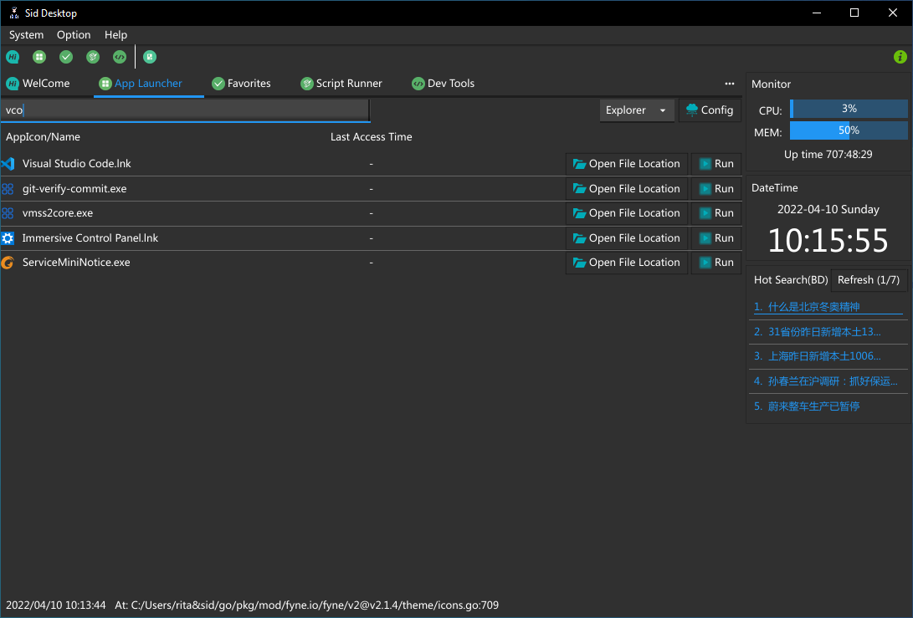
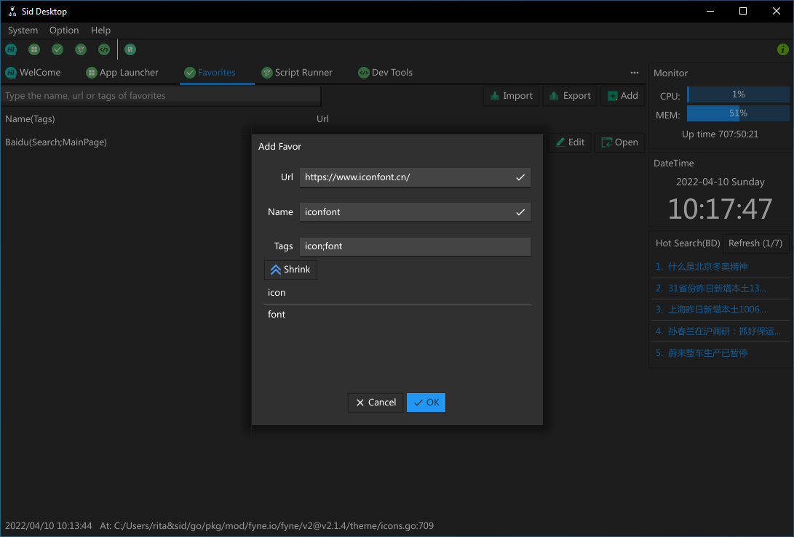
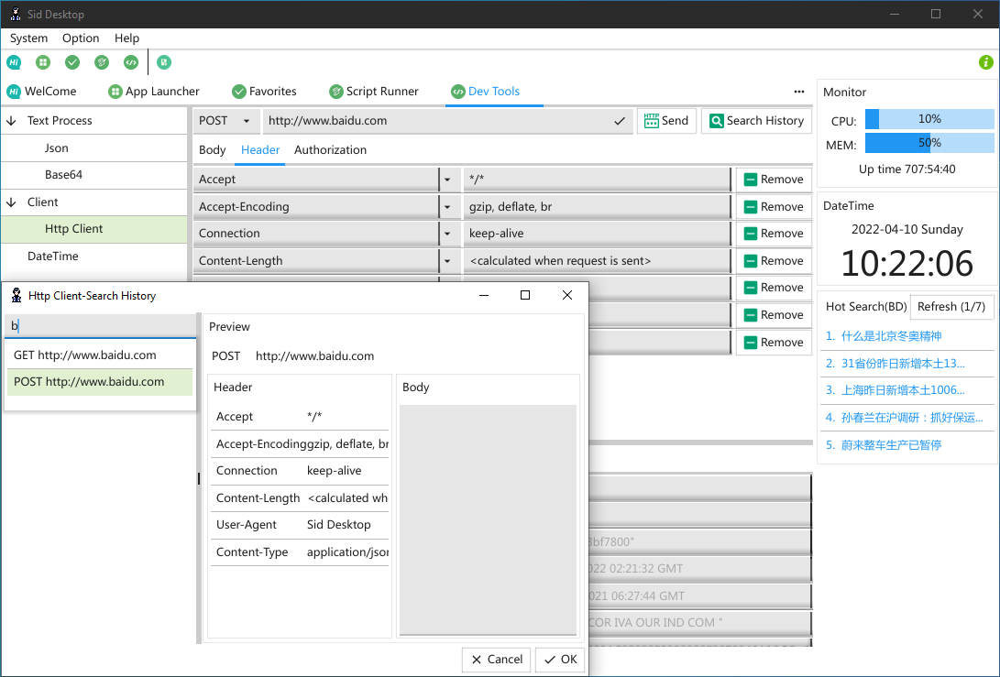
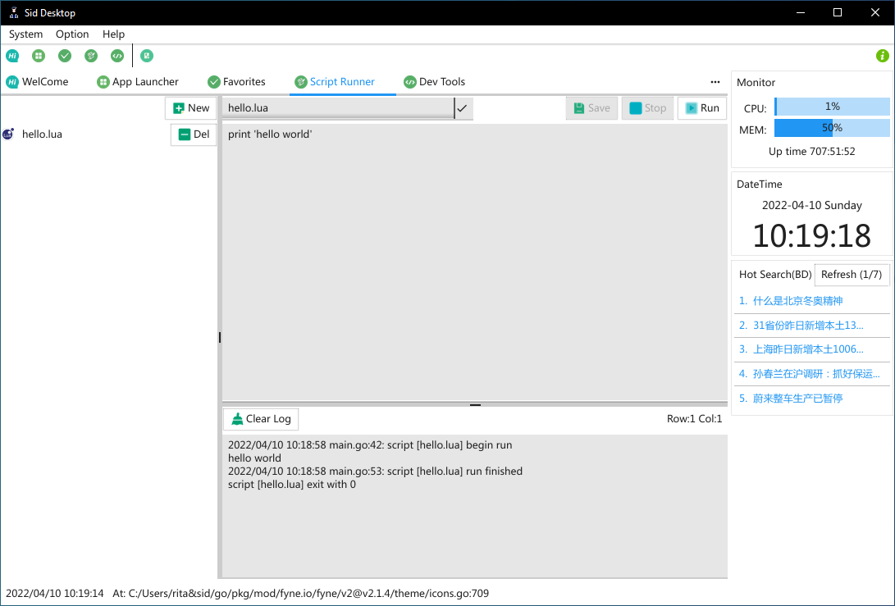
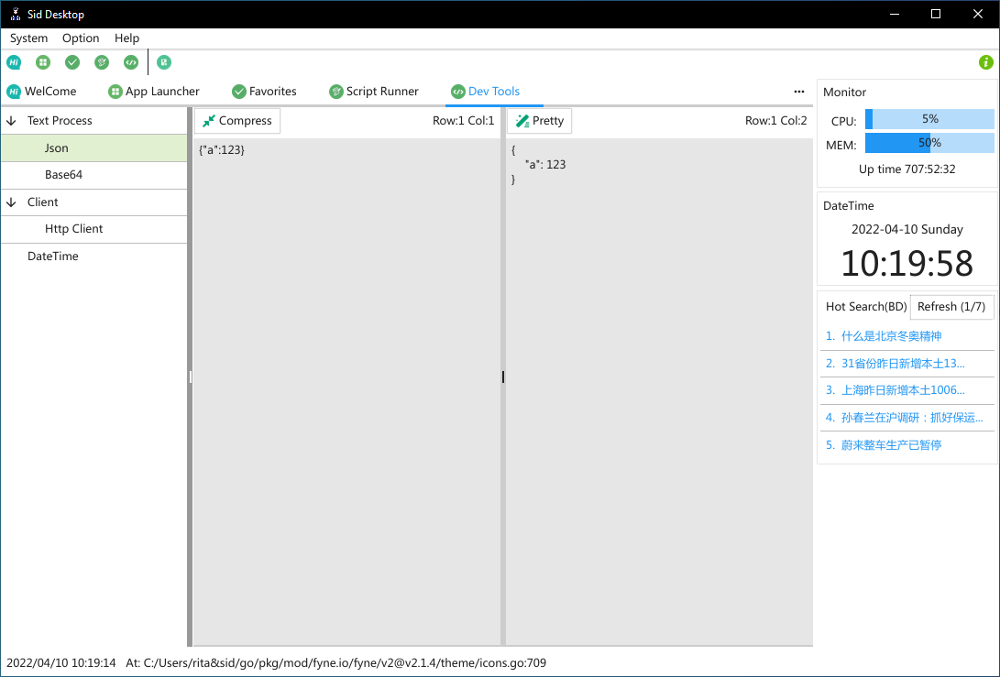

# About

Sid Desktop is a desktop software based on [Fyne](https://fyne-io).
It is designed to build applications that provides a collection of commonly tools.

It should be noted that this software is built purely for personal interest and can be used for learning and communication. 

# ScreenShorts
<div align="center">
  <table cellpadding="0" cellspacing="0" style="margin: auto; border-collapse: collapse;">
    <tr style="border: none;">
      <td style="border: none;">
        
      </td>
      <td style="border: none;">
        
      </td>
    </tr>
    <tr style="border: none;">
      <td style="border: none;">
        
      </td>
      <td style="border: none;">
        
      </td>
    </tr>
     <tr style="border: none;">
      <td style="border: none;">
        
      </td>
      <td style="border: none;">
        
      </td>
    </tr>
  </table>
</div>

# Prerequisites

To build sid-desktop you will need Go version 1.14 or later, a C compiler.
If you're not sure if that's all installed or you don't know how then check out the document [Getting Started](https://fyne.io/develop/).

# Features
- Applicaiton Container
  - Application Launcher
    - App Launcher is inspired by [prosper](https://github.com/ventsislav-georgiev/prosper). You can find app in computer with fuzzy search, and open it directly.
  - Favorites
  - ScriptRunner
    - Support Lua
  - Dev Tools
    - Codec
      - base64
      - Json
    - DateTime
    - HttpClient
  - Sodor Frontend (WIP)
    - [Sodor Backend](https://github.com/BabySid/sodor)
- Desktop Toys
  - Resource Monitor
  - DateTime
  - Hot Search

# Installing

Sid-Desktop only supports **Windows** now.

```
.\build.bat
```

Then you can find the binary in the directory `output`

# TODO
- auto refresh window when theme switched
- add max-len for validator of entry
- tooltip for entry
- init db on splash before main window is shown
- IO asynchronization via channel
- metrics for sodor
  - gauge for thomas instance which is range from [0, 100]
  - line(smooth) for task instance which is number
- app config(e.g. http server port, cloud dir)